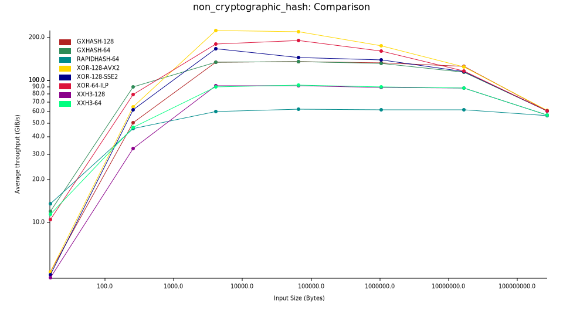
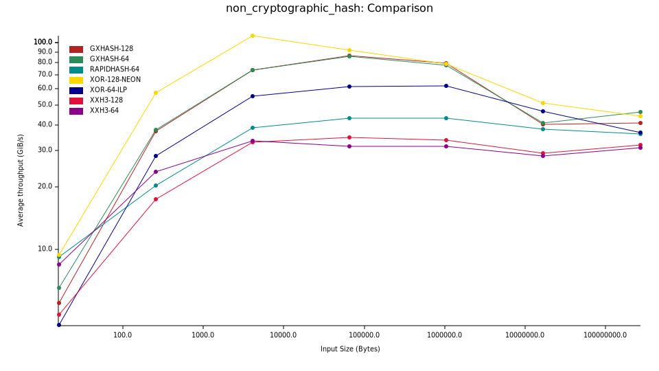
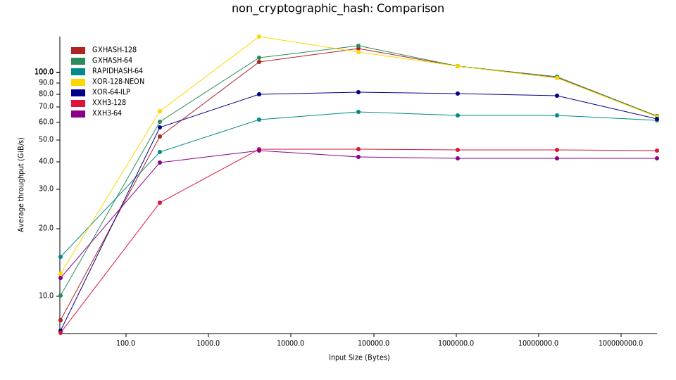
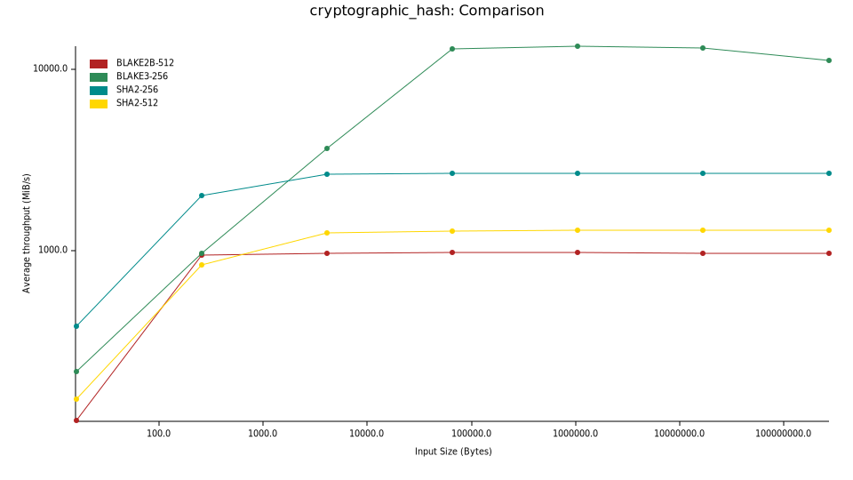
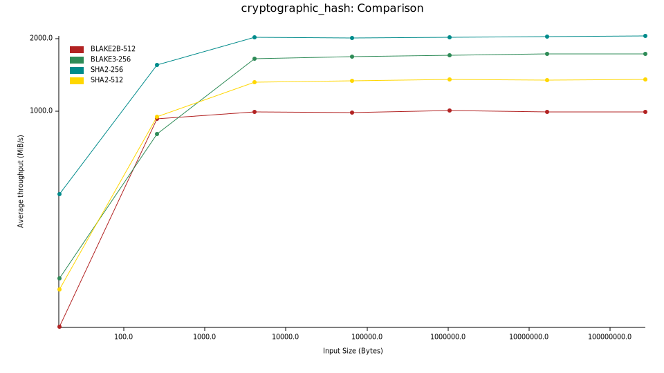
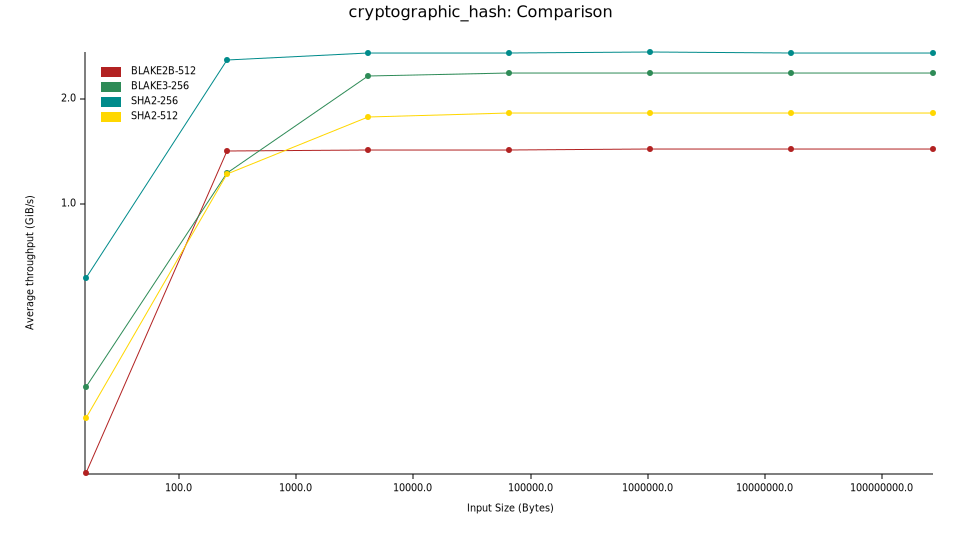

# Benchmark Results

## Non-Cryptographic Hash Throughput

### [AMD Ryzen 9 9950X 16-Core Processor](../results/amd-ryzen-9-9950x-16-core-processor/README.md)

### [Apple M1](../results/apple-m1/README.md)

### [Apple M4](../results/apple-m4/README.md)

## Cryptographic Hash Throughput

### [AMD Ryzen 9 9950X 16-Core Processor](../results/amd-ryzen-9-9950x-16-core-processor/README.md)

### [Apple M1](../results/apple-m1/README.md)

### [Apple M4](../results/apple-m4/README.md)

